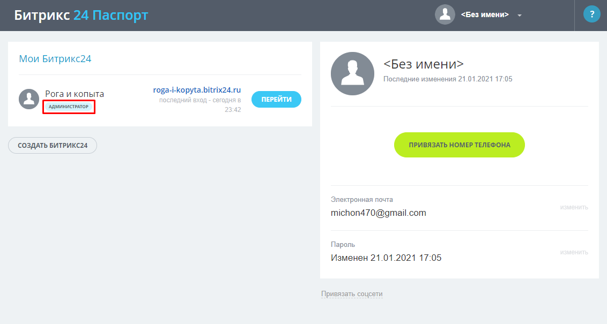
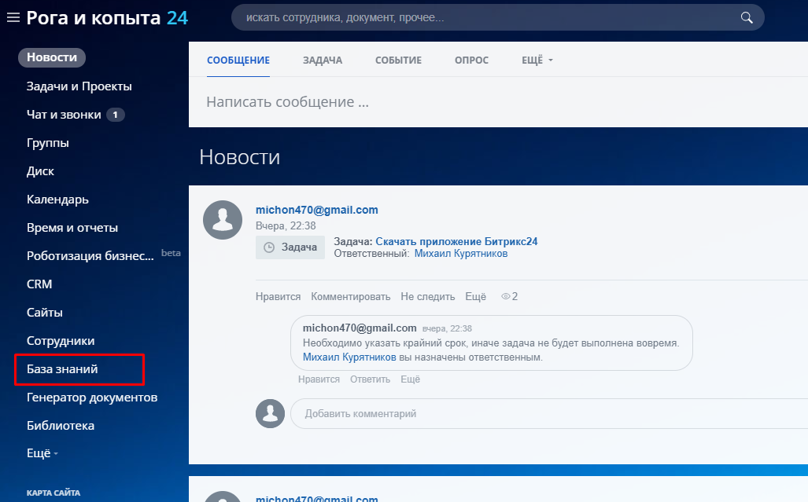

# Установка модуля «База знаний» на облачную версию Битрикс24

Модуль может установить только администратор системы.  
Вы можете узнать о наличии у вас прав администратора на сайте [Битрикс24&nbsp;Паспорт](https://www.bitrix24.net/) — в разделе **Мои&nbsp;Битрикс24**, под названием компании, должен отображаться текст **Администратор**.  

Если у вас нет прав администратора, вы можете отправить запрос на установку администраторам. Система предложит это сделать, когда вы попытаетесь установить модуль.

## Поиск и установка
1. Зайдите на ваш сайт Битрикс24.
2. В правом верхнем углу нажмите на ваше имя или электронную почту.
3. В появившемся списке выберите **Расширения** → **Приложения**
4. В поисковую строку введите текст «Эм Си Арт».
5. Нажмите на название расширения **База знаний** или кнопку **ПОСМОТРЕТЬ**.
6. Нажмите кнопку **УСТАНОВИТЬ**.
7. Прочитайте **Лицензионное соглашение** и **Политику конфиденциальности**, отметьте пункты галочками и нажмите **УСТАНОВИТЬ**.
8. В открывшемся окне вы можете назначить администраторов приложения из числа сотрудников:  
    1. нажмите **ДОБАВИТЬ**;
    2. введите имена нужных сотрудников;
    3. нажмите **СОХРАНИТЬ**.
9. По завершении установки модуль откроется.

Готово — теперь модуль **База знаний** можно открыть из главного меню в левой части экрана.

